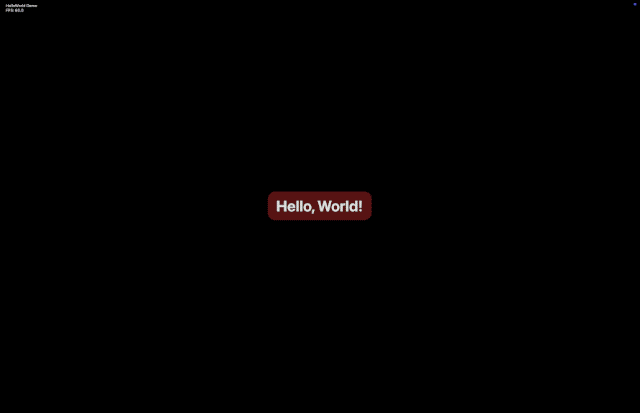
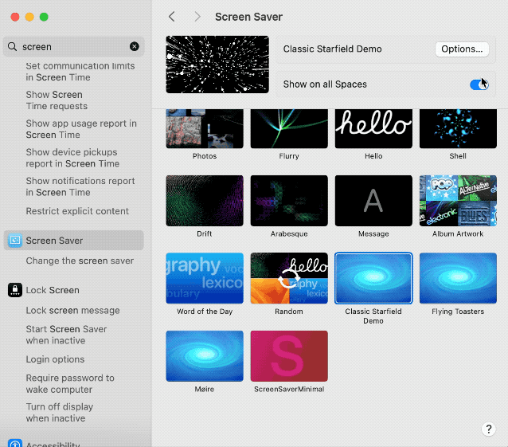

# ScreenSaverKit

`ScreenSaverKit` is a lightweight helper layer for building macOS ScreenSaver
modules without having to re-implement the plumbing that every saver needs.
Treat it as a starting point that you can copy into any new screensaver project.



## What you get

- ✅ Automatic default registration and preference persistence
- ✅ Cross-process preference change monitoring (System Settings ↔ saver engine)
- ✅ Convenience accessors for reading/writing `ScreenSaverDefaults`
- ✅ Proper animation start/stop handling across preview, WallpaperAgent and ScreenSaverEngine hosts
- ✅ Asset loading helpers, animation timing utilities, entity pooling, and diagnostics hooks
- ✅ Pre-built configuration sheet scaffolding with preference binding helpers

Keeping these concerns in one place lets each screensaver focus on drawing
and behaviour instead of boilerplate.



## Getting Started

**New to ScreenSaverKit?** Check out the **[complete tutorial](tutorial.md)** for a step-by-step walkthrough that covers building your first screen saver, understanding the code, debugging, and creating your own custom savers.

## How to use it

1. **Copy the kit**  
   Grab the `ScreenSaverKit/` directory and drop it into your saver project.

2. **Subclass `SSKScreenSaverView`**

   ```objective-c
   #import "ScreenSaverKit/SSKScreenSaverView.h"

   @interface SimpleLinesView : SSKScreenSaverView
   @end
   ```

3. **Provide defaults**

   ```objective-c
   - (NSDictionary<NSString *, id> *)defaultPreferences {
       return @{
           @"lineCount": @200,
           @"colorRate": @0.2
       };
   }
   ```

4. **React to preference changes**

   Whenever the user changes a setting (even from the System Settings pane)
   the kit calls back into your saver:

   ```objective-c
   - (void)preferencesDidChange:(NSDictionary<NSString *, id> *)prefs
                    changedKeys:(NSSet<NSString *> *)changed {
       self.lineCount = [prefs[@"lineCount"] integerValue];
       self.colorRate = [prefs[@"colorRate"] doubleValue];

       if ([changed containsObject:@"lineCount"]) {
           [self rebuildLines];
       }
   }
   ```

5. **Draw as normal**

   Implement `drawRect:`, `animateOneFrame`, etc. just as you would in a plain
   `ScreenSaverView` subclass. For smooth timing call `NSTimeInterval dt = [self advanceAnimationClock];`
   in `-animateOneFrame` and use the returned delta.

## Helper modules

- `SSKAssetManager` – cached bundle resource lookup with extension fallbacks
  for images/data. Available via `self.assetManager` on the saver view.
- `SSKAnimationClock` – smooth delta-time tracking and FPS reporting. Call
  `NSTimeInterval dt = [self advanceAnimationClock];` inside
  `-animateOneFrame` and inspect `self.animationClock.framesPerSecond`.
- `SSKEntityPool` – simple object pooling for sprites/particles. Create pools
  with `makeEntityPoolWithCapacity:factory:`.
- `SSKScreenUtilities` – helpers for scaling information, wallpaper-host
  detection, and screen dimensions.
- `SSKDiagnostics` – opt-in logging and overlay drawing. Toggle with
  `[SSKDiagnostics setEnabled:YES]` and draw overlays inside `-drawRect:`.
- `SSKPreferenceBinder` + `SSKConfigurationWindowController` – drop-in UI
  scaffold for settings windows with automatic binding between controls and
  `ScreenSaverDefaults`.

## Starter template

- `TemplateSaverView.h/.m` – a minimal saver that animates a few shapes and
  responds to preference changes. Copy and rename these files to kick off a
  new project.
- `TemplateInfo.plist` – barebones bundle metadata. Update the identifiers and
  version fields to match your saver.
- `Makefile.demo` – shows how to compile a `.saver` bundle using the template
  view plus `SSKScreenSaverView`. Run `make -f ScreenSaverKit/Makefile.demo`
  from your project root (or copy it beside your sources) and tweak the
  variables at the top for your module name and bundle ID.
- The template demonstrates the configuration sheet helpers (sliders +
  checkbox), diagnostics overlay toggling, and the animation clock workflow.
- `Demos/HelloWorld/` – a ready-to-build "Hello, World" saver that bounces
  text around the screen with optional colour cycling. Build it via
  `make -f Demos/HelloWorld/Makefile`. See [tutorial.md](tutorial.md) for a
  complete walkthrough using this demo.
- `Demos/Starfield/` – a classic faux-3D starfield with optional motion blur
  and drifting trajectory changes. Build it via
  `make -f Demos/Starfield/Makefile`.
- `Demos/SimpleLines/` – layered drifting lines with palette selection and
  adjustable colour cycling speed. Build it via
  `make -f Demos/SimpleLines/Makefile`.
- `scripts/install-and-refresh.sh` – convenience script that builds, installs,
  and restarts the relevant macOS services (`legacyScreenSaver`,
  `WallpaperAgent`, `ScreenSaverEngine`) so macOS immediately sees your latest
  bundle. Usage:

  ```bash
  ./scripts/install-and-refresh.sh Demos/Starfield
  ./scripts/install-and-refresh.sh ScreenSaverKit -f Makefile.demo
  ```

  The first argument is the directory containing the saver Makefile; any
  additional arguments are passed straight through to each `make` invocation.
- `scripts/refresh-screensaver-services.sh` – lightweight helper that just
  restarts the caching services (and optionally relaunches `ScreenSaverEngine`)
  when you already have a bundle installed:

  ```bash
  ./scripts/refresh-screensaver-services.sh
  ./scripts/refresh-screensaver-services.sh --launch
  ```

⚠️ **macOS caching note:** System Settings aggressively caches screen saver
bundles. If you rebuild but don’t see changes, run the install-and-refresh
script or manually quit `legacyScreenSaver`, `WallpaperAgent`, and
`ScreenSaverEngine`, then reopen the Screen Saver panel.

## Updating the demo savers after kit changes

If you tweak code inside `ScreenSaverKit/`, rebuild any demos you want to test
so they pick up the new implementation:

```bash
cd Demos/Starfield && make clean all
cd Demos/SimpleLines && make clean all
```

After installing the refreshed bundle, restart the caching daemons to force
macOS to load the new bits:

```bash
./scripts/refresh-screensaver-services.sh
./scripts/refresh-screensaver-services.sh --launch   # optionally relaunches the preview
```

This mirrors the workflow shown earlier (`make …`, then refresh) and avoids the
“preview updated, full screen is stale” confusion that can happen otherwise.

## Building the demo saver

```bash
# From the project root (or wherever you copied the kit)
make -f ScreenSaverKit/Makefile.demo clean all
```

- Outputs a bundle at `ScreenSaverKit/DemoBuild/TemplateSaver.saver`.
- Compiles a **universal binary** that supports both `arm64` (Apple Silicon)
  and `x86_64` (Intel) via the `-arch` flags already in `Makefile.demo`.
- Verify the architectures with:

  ```bash
  file ScreenSaverKit/DemoBuild/TemplateSaver.saver/Contents/MacOS/TemplateSaver
  ```

- Install locally for testing:

  ```bash
  make -f ScreenSaverKit/Makefile.demo run
  ```

Update `SCREENSAVER_NAME`, `BUNDLE_ID`, and `PRINCIPAL_CLASS` at the top of the
Makefile when you adapt the template for your own saver.

## Signing and notarizing

macOS Ventura and newer require downloaded screen savers to be signed with a
Developer ID certificate (and ideally notarized) before they will load without
warnings. Replace the placeholder values below with your own Team ID and
bundle details.

```bash
# Sign the bundle
codesign --force --timestamp --options runtime \
  --identifier com.example.templatesaver \
  --sign "Developer ID Application: Your Name (TEAMID)" \
  ScreenSaverKit/DemoBuild/TemplateSaver.saver

# Optional: verify signature
codesign --verify --strict --verbose=2 ScreenSaverKit/DemoBuild/TemplateSaver.saver

# Optional: zip bundle then submit for notarization (requires a notarytool profile)
ditto -c -k --keepParent ScreenSaverKit/DemoBuild/TemplateSaver.saver \
  ScreenSaverKit/DemoBuild/TemplateSaver.saver.zip
xcrun notarytool submit ScreenSaverKit/DemoBuild/TemplateSaver.saver.zip \
  --keychain-profile your-notary-profile --wait
```

If you follow the same structure as the demo Makefile, you can reuse the
root-level `sign`, `zip`, and `notarize` targets (update the variables to match
your saver).

## Preference helpers

Use the provided convenience methods when you want to manipulate preferences
manually:

- `- (ScreenSaverDefaults *)preferences;`
- `- (NSDictionary<NSString *, id> *)currentPreferences;`
- `- (void)setPreferenceValue:(id)value forKey:(NSString *)key;`
- `- (void)removePreferenceForKey:(NSString *)key;`
- `- (void)resetPreferencesToDefaults;`

## Adapting the Makefile

The root `Makefile` already includes `ScreenSaverKit/SSKScreenSaverView.m`
in the build. When starting a new saver:

1. Update `SCREENSAVER_NAME`, `BUNDLE_ID`, and `Info.plist` to match your saver.
2. Add your own `.m` files to the `SOURCES` list.
3. Run `make` or `make test` to produce a `.saver` bundle.

## Updating existing savers

To migrate an older saver code base:

1. Replace `ScreenSaverView` superclass usages with `SSKScreenSaverView`.
2. Remove any custom preference polling timers – the kit handles it now.
3. Move default registration into `-defaultPreferences`.
4. Migrate preference reload code into `-preferencesDidChange:changedKeys:`.

Use these steps to retrofit the kit into existing code and keep the rendering
logic focused on your unique saver behaviour.
