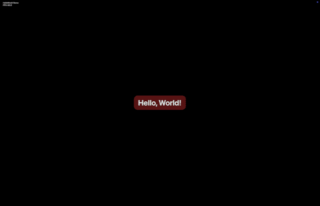
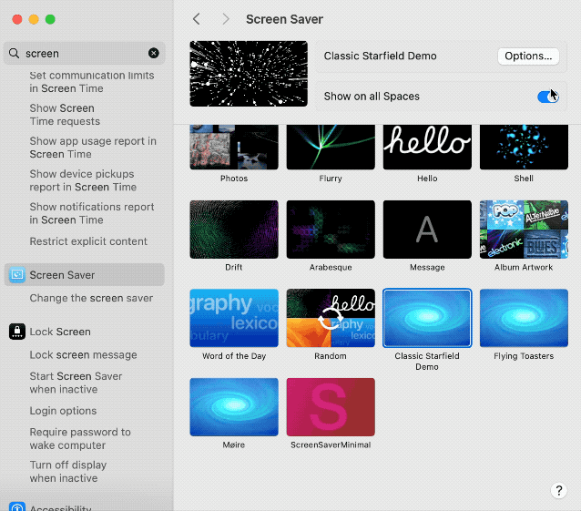

# ScreenSaverKit

`ScreenSaverKit` is a lightweight helper layer for building macOS ScreenSaver modules without having to re-implement the plumbing that every saver needs. Treat it as a starting point that you can copy into any new screensaver project. It gives you access to both CPU and Metal-accelerated rendering paths, built-in preference management, configuration sheet scaffolding, and a particle system.

There's plenty of demo savers included to illustrate how to use the various features, plus a complete tutorial in [tutorial.md](tutorial.md) that walks you through building your first saver from scratch.

Currently this is in alpha development, so expect possible breaking changes in future releases. Feedback and contributions are welcome!



## What you get

- ✅ Automatic default registration and preference persistence
- ✅ Cross-process preference change monitoring (System Settings ↔ saver engine)
- ✅ Convenience accessors for reading/writing `ScreenSaverDefaults`
- ✅ Proper animation start/stop handling across preview, WallpaperAgent and ScreenSaverEngine hosts
- ✅ Asset loading helpers, animation timing utilities, entity pooling, and diagnostics hooks
- ✅ Pre-built configuration sheet scaffolding with preference binding helpers
- ✅ Particle system with GPU simulation, GPU spawn, and Metal rendering (CPU fallback)
- ✅ Color palette management and interpolation utilities
- ✅ Vector math helpers for smooth animations

Keeping these concerns in one place lets each screensaver focus on drawing and behavior instead of boilerplate.



## Getting Started

**New to ScreenSaverKit?** Check out the **[complete tutorial](tutorial.md)** for a step-by-step walkthrough that covers building your first screen saver, understanding the code, debugging, and creating your own custom savers.

## How to use it

1. **Copy the kit**  
   Grab the `ScreenSaverKit/` directory and drop it into your saver project.

2. **Subclass `SSKScreenSaverView`**

   ```objective-c
   #import "ScreenSaverKit/SSKScreenSaverView.h"

   @interface SimpleLinesView : SSKScreenSaverView
   @end
   ```

3. **Provide defaults**

   ```objective-c
   - (NSDictionary<NSString *, id> *)defaultPreferences {
       return @{
           @"lineCount": @200,
           @"colorRate": @0.2
       };
   }
   ```

4. **React to preference changes**

   Whenever the user changes a setting (even from the System Settings pane) the kit calls back into your saver:

   ```objective-c
   - (void)preferencesDidChange:(NSDictionary<NSString *, id> *)prefs
                    changedKeys:(NSSet<NSString *> *)changed {
       self.lineCount = [prefs[@"lineCount"] integerValue];
       self.colorRate = [prefs[@"colorRate"] doubleValue];

       if ([changed containsObject:@"lineCount"]) {
           [self rebuildLines];
       }
   }
   ```

5. **Draw as normal**

   Implement `drawRect:`, `animateOneFrame`, etc. just as you would in a plain `ScreenSaverView` subclass. For smooth timing call `NSTimeInterval dt = [self advanceAnimationClock];` in `-animateOneFrame` and use the returned delta.

## Helper modules

- `SSKAssetManager` – cached bundle resource lookup with extension fallbacks for images/data. Available via `self.assetManager` on the saver view.
- `SSKAnimationClock` – smooth delta-time tracking and FPS reporting. Call `NSTimeInterval dt = [self advanceAnimationClock];` inside `-animateOneFrame` and inspect `self.animationClock.framesPerSecond`.
- `SSKEntityPool` – simple object pooling for sprites/particles. Create pools with `makeEntityPoolWithCapacity:factory:`.
- `SSKScreenUtilities` – helpers for scaling information, wallpaper-host detection, and screen dimensions.
- `SSKDiagnostics` – opt-in logging and overlay drawing. Toggle with
  `[SSKDiagnostics setEnabled:YES]` and draw overlays inside `-drawRect:`.
- `SSKPreferenceBinder` + `SSKConfigurationWindowController` – drop-in UI scaffold for settings windows with automatic binding between controls and `ScreenSaverDefaults`.
- `SSKColorPalette` + `SSKPaletteManager` – shared palette definitions with interpolation helpers and registration per saver module.
- `SSKColorUtilities` – convenience serializers/deserializers for storing `NSColor` instances inside `ScreenSaverDefaults`.
- `SSKVectorMath` – small collection of inline NSPoint helpers (add, scale, reflect, clamp) for animation math.
- `SSKParticleSystem` – particle engine with **GPU simulation** (Metal compute), **GPU spawn** (`spawnParticlesGPU:parameters:` for parameterized batches), and CPU/Metal rendering. Supports additive/alpha blending, behavior options (fade alpha/size, color gradient, curl noise, attractors, velocity hue, ribbon mode, z-depth), optional culling, and custom `updateHandler`/`renderHandler`. Includes a 2D curl noise force field for organic swirling motion, up to 4 configurable attractor points with inverse-square falloff, and per-particle rotation. Use `spawnParticles:initializer:` for custom per-particle setup or `spawnParticlesGPU:parameters:` for fast bulk spawns. See `ScreenSaverKit/SSKParticleSystem.md` for details.
- `SSKMetalTrailPass` – persistent offscreen trail buffer that creates long, luminous particle trails. Each frame fades the previous contents and composites new particle draws on top. Controlled via `SSKMetalRenderer.trailPersistenceEnabled` and `trailFadeRate`. Used by the Flux demo for flowing energy streams.
- `SSKMetalParticleRenderer` – Metal particle renderer used by `SSKParticleSystem.renderWithMetalRenderer:blendMode:viewportSize:`. Handles GPU pipeline setup, drawable management, and instanced rendering. Optional `useIndirectRendering` for GPU-built instance buffers.
- `SSKMetalRenderer` + `SSKMetalEffectStage` – extensible Metal post-processing effect system. Register custom effect passes (blur, bloom, color grading, etc.) without modifying framework code. Supports dynamic effect chains with configurable parameters. Built-in blur and bloom effects included. See `architecture-docs/EFFECT_IMPLEMENTATION_GUIDE.md` for detailed documentation on creating custom Metal shader effects.
- `SSKMetalSpritePass` + `SSKSprite` – 2D sprite rendering system for classic sprite-based screensavers (flying toasters, DVD logo, etc.). Supports position, rotation, non-uniform scaling, horizontal/vertical flipping, color tinting, opacity, z-ordering, and multiple blend modes. Features include sprite animation sequences with loop/ping-pong modes, viewport culling for performance, and pixel-based coordinate system with Retina support. Uses instanced rendering for efficient batch drawing of multiple sprites. See `Demos/DVDLogoMetal/README.md` for a tutorial.
- `SSKSpriteAnimationSequence` – Immutable animation sequence data for sprite sheet animations. Supports grid-based and custom rect-based sequences, loop modes (Once, Loop, PingPong), per-frame durations, and time-based frame lookup. Integrates seamlessly with `SSKSprite` for automatic UV coordinate updates.
- `SSKMetalRenderDiagnostics` – real-time Metal rendering diagnostics overlay. Tracks rendering success/failure rates, displays device/layer/renderer status, and shows FPS. Automatically renders a semi-transparent overlay on your CAMetalLayer for debugging Metal pipeline issues. Perfect for development and troubleshooting GPU initialization problems. See `Demos/MetalParticleTest/` for usage example.

## Architecture Documentation

For detailed information about ScreenSaverKit's internal architecture, see the **[Architecture Documentation Index](architecture-docs/ARCHITECTURE_INDEX.md)** which provides:

- **[Architecture Analysis](architecture-docs/ARCHITECTURE_ANALYSIS.md)** – In-depth technical analysis of the effect chaining system, Metal rendering pipeline, particle system integration, and design patterns
- **[Architecture Diagrams](architecture-docs/ARCHITECTURE_DIAGRAMS.md)** – Visual component relationships, rendering pipelines, and dependency graphs
- **[Effect Implementation Guide](architecture-docs/EFFECT_IMPLEMENTATION_GUIDE.md)** – Step-by-step guide for creating custom Metal effects, understanding the rendering flow, and debugging tips

The architecture docs cover:
- FX Pass-based architecture (Particle, Blur, Bloom passes)
- Metal shader organization and compute kernels
- Texture cache strategy and memory management
- GPU-accelerated particle spawning with z-depth support
- Testing architecture and test coverage
- Performance optimizations and recent improvements

## Using the Particle System

The particle system supports **GPU simulation** (Metal compute), **GPU spawn** (parameterized batches), and **CPU or Metal rendering**. Simulation and rendering automatically use the GPU when a Metal device is available; attaching a custom `updateHandler` disables GPU simulation and uses the CPU path.

**Quick Start (CPU spawn + Metal render):**
```objective-c
// Create particle system (optionally pass device for GPU simulation)
self.particleSystem = [[SSKParticleSystem alloc] initWithCapacity:1024];
self.particleSystem.blendMode = SSKParticleBlendModeAdditive;  // or SSKParticleBlendModeAlpha

// For Metal rendering, set up a CAMetalLayer
self.wantsLayer = YES;
CAMetalLayer *metalLayer = [CAMetalLayer layer];
metalLayer.device = MTLCreateSystemDefaultDevice();
self.layer = metalLayer;
self.metalRenderer = [[SSKMetalParticleRenderer alloc] initWithLayer:metalLayer];

// Spawn particles (custom initializer)
[self.particleSystem spawnParticles:100 initializer:^(SSKParticle *particle) {
    particle.position = center;
    particle.velocity = NSMakePoint(cos(angle) * speed, sin(angle) * speed);
    particle.color = [NSColor colorWithHue:hue saturation:0.8 brightness:1.0 alpha:1.0];
    particle.maxLife = 2.0;
    particle.size = 10.0;
    particle.behaviorOptions = SSKParticleBehaviorOptionFadeAlpha | SSKParticleBehaviorOptionFadeSize;
}];

// In animateOneFrame, update and render
[self.particleSystem advanceBy:deltaTime];
[self.particleSystem renderWithMetalRenderer:self.metalRenderer
                                   blendMode:self.particleSystem.blendMode
                                viewportSize:self.bounds.size];
```

**GPU spawn (parameterized batches):** For large, range-based spawns (e.g. rain, bursts), use `spawnParticlesGPU:parameters:` with `SSKParticleSpawnParameters` (region type, velocity/size/life/color ranges, direction, z-depth, etc.). Much faster than per-particle initializer blocks when you don’t need custom logic. See `Demos/Rain/` for z-depth rain and `ScreenSaverKit/SSKParticleSystem.h` for the full parameter struct.

**Behavior options:** Use `SSKParticleBehaviorOptions` for fade alpha/size, color gradient (`endColor`), curl noise, attractors, velocity hue, ribbon mode, and more. These run on both CPU and GPU simulation paths.

**Advanced features:**
- **Curl noise** – Set `noiseScale`, `noiseStrength`, `noiseSpeed` on the particle system and enable `SSKParticleBehaviorOptionCurlNoise` for organic, swirling motion driven by a 2D divergence-free noise field.
- **Attractor points** – Use `setAttractorAtIndex:position:strength:` (up to 4) with `SSKParticleBehaviorOptionAttractors` to pull particles toward configurable points with inverse-square falloff.
- **Trail persistence** – Set `renderer.trailPersistenceEnabled = YES` and `renderer.trailFadeRate` to create long, luminous trails that slowly fade over time.
- **Color gradient** – Set `endColor` on particles (or `endColorMin`/`endColorMax` in spawn params) with `SSKParticleBehaviorOptionColorGradient` to interpolate color over the particle's lifetime.
- **Ribbon mode** – Set `particleSystem.ribbonModeEnabled = YES` to connect adjacent alive particles into elongated ribbon strips instead of isolated quads.

**CPU fallback:** If Metal isn't available or the renderer returns `NO`, the system falls back to CPU rendering; use `drawInContext:` in `drawRect:` for the CPU draw path.

See `Demos/Flux/` for curl noise + attractors + trails, `Demos/RibbonFlow/` for flowing ribbons, `Demos/Rain/` for z-depth rain, and `ScreenSaverKit/SSKParticleSystem.md` for detailed API documentation.

## Using Metal-Accelerated Sprites

The sprite system provides hardware-accelerated 2D rendering for classic sprite-based effects with support for scaling, flipping, animation sequences, and viewport culling.

**Quick Start:**
```objective-c
// Subclass SSKMetalScreenSaverView for automatic Metal setup
@interface MySpriteSaver : SSKMetalScreenSaverView
@property (nonatomic, strong) SSKSprite *logoSprite;
@property (nonatomic, strong) id<MTLTexture> logoTexture;
@end

// Create sprite in setupMetalRenderer:
- (void)setupMetalRenderer:(SSKMetalRenderer *)renderer {
    [super setupMetalRenderer:renderer];
    
    self.logoSprite = [[SSKSprite alloc] init];
    
    // Use pixel coordinates (convert from points for Retina)
    CGFloat scale = (self.window != nil) ? self.window.backingScaleFactor : 1.0;
    [self.logoSprite setPositionInPoints:NSMakePoint(100, 100) scale:scale];
    
    self.logoSprite.size = NSMakeSize(180, 100);  // Size in pixels
    self.logoSprite.scale = CGSizeMake(1.0, 1.0);  // Scale multiplier
    self.logoSprite.colorTint = [NSColor redColor];
    self.logoSprite.opacity = 1.0;
    
    // Load texture from image
    self.logoSprite.image = [NSImage imageNamed:@"logo"];
    self.logoTexture = [self.logoSprite textureForDevice:renderer.device];
}

// Render in renderMetalFrame:deltaTime:
- (void)renderMetalFrame:(SSKMetalRenderer *)renderer deltaTime:(NSTimeInterval)dt {
    [renderer clearWithColor:renderer.clearColor];
    
    // Update sprite animation
    NSPoint pos = self.logoSprite.position;
    pos.x += self.velocity.x * dt;
    CGFloat scale = (self.window != nil) ? self.window.backingScaleFactor : 1.0;
    [self.logoSprite setPositionInPoints:pos scale:scale];
    
    // Draw sprite (renderer uses render target pixel dimensions for viewport)
    [renderer drawSprites:@[self.logoSprite]
                  texture:self.logoTexture
                blendMode:SSKParticleBlendModeAlpha];
}
```

**Sprite Properties:**
- `position` – Anchor point position in pixels (not necessarily center)
- `size` – Width and height in pixels
- `scale` – Scale multiplier (CGSize). Negative values flip the sprite (canonical flip mechanism)
- `flipX`/`flipY` – Convenience properties that modify scale sign
- `rotation` – Rotation angle in radians (direction depends on coordinate transform)
- `anchor` – Anchor point for rotation/positioning (0,0 = bottom-left, 0.5,0.5 = center, 1,1 = top-right)
- `colorTint` – Color multiplied with texture (white = no tint)
- `opacity` – Alpha multiplier (0.0-1.0)
- `z` – Z-order for depth sorting (higher values render in front)
- `image` – Source NSImage for texture creation
- `textureOffset`/`textureSize` – UV coordinates for sprite sheets (normalized 0-1)

**Animation System:**
```objective-c
// Create animation sequence from grid-based sprite sheet
SSKSpriteAnimationSequence *anim = [SSKSpriteAnimationSequence 
    sequenceWithGridColumns:4 rows:2 frameCount:8 
    duration:0.1 loopMode:SSKAnimationLoopModeLoop];

// Assign to sprite
self.logoSprite.animation = anim;
self.logoSprite.animationRate = 1.0;  // Playback speed
self.logoSprite.animationPlaying = YES;

// Advance animation each frame
- (void)renderMetalFrame:(SSKMetalRenderer *)renderer deltaTime:(NSTimeInterval)dt {
    [self.logoSprite advanceAnimationByTime:dt];
    // ... render ...
}
```

**Coordinate System:**
- All sprite coordinates and sizes are in **pixels** (not points)
- On Retina displays, multiply points by `window.backingScaleFactor` or `layer.contentsScale`
- Use `setPositionInPoints:scale:` helper to convert from points to pixels
- `SSKMetalRenderer.drawSprites:texture:blendMode:` (and the `sortByZ:` variant) do not take viewport size—the renderer uses the render target's pixel dimensions internally

**Advanced Features:**
- **Viewport Culling** – Enable `spritePass.cullingEnabled = YES` to skip off-screen sprites
- **Z-Sorting** – Pass `sortByZ:YES` to `drawSprites:` for automatic back-to-front sorting
- **Sprite Sheets** – Use `setTextureRectInPixels:textureSize:` for atlas-based sprites
- **Flip/Mirror** – Set `scale.width < 0` for horizontal flip, `scale.height < 0` for vertical flip, or use `flipX`/`flipY` convenience properties

**Blend Modes:**
- `SSKParticleBlendModeAlpha` – Standard alpha blending for opaque/transparent sprites (uses premultiplied alpha; color tinting is correctly applied with proper alpha scaling)
- `SSKParticleBlendModeAdditive` – Additive blending for glow effects

**API:**
- `SSKMetalRenderer.drawSprites:texture:blendMode:` and `drawSprites:texture:blendMode:sortByZ:` do not take a viewport parameter; the renderer uses the active render target's pixel dimensions
- Deprecated `drawSprites:...viewportSize:...` variants on `SSKMetalRenderer` are still available but ignore the viewport size (forwarders call the new API)

See `Demos/DVDLogoMetal/` for a complete working example with bounce physics, color cycling, and flip-on-bounce effects.

### Debugging Metal Rendering

For troubleshooting Metal rendering issues, use `SSKMetalRenderDiagnostics`:

```objective-c
// Create diagnostics helper
self.renderDiagnostics = [[SSKMetalRenderDiagnostics alloc] init];

// Attach to your Metal layer
[self.renderDiagnostics attachToMetalLayer:self.metalLayer];

// Update status as you initialize components
self.renderDiagnostics.deviceStatus = [NSString stringWithFormat:@"Device: %@", device.name];
self.renderDiagnostics.layerStatus = @"Layer: configured";
self.renderDiagnostics.rendererStatus = @"Renderer: ready";

// In animateOneFrame, record rendering attempts
BOOL renderSuccess = [self.particleSystem renderWithMetalRenderer:self.metalRenderer
                                                         blendMode:self.particleSystem.blendMode
                                                      viewportSize:self.bounds.size];
[self.renderDiagnostics recordMetalAttemptWithSuccess:renderSuccess];

// Update overlay with custom info
NSArray *extraInfo = @[
    [NSString stringWithFormat:@"Particles: %lu", self.particleSystem.aliveParticleCount]
];
[self.renderDiagnostics updateOverlayWithTitle:@"My Saver"
                                    extraLines:extraInfo
                               framesPerSecond:self.animationClock.framesPerSecond];
```

The diagnostics overlay displays:
- **Device**: Metal device name and capabilities (e.g., "Apple M1", low power status)
- **Layer**: CAMetalLayer configuration status
- **Renderer**: SSKMetalRenderer initialization state
- **Drawable**: Drawable availability and acquisition success
- **Metal successes / fallbacks**: Running counter of rendering attempts
- **FPS**: Current frame rate

Toggle the overlay on/off with:
```objective-c
self.renderDiagnostics.overlayEnabled = NO;  // Hide overlay
self.renderDiagnostics.overlayEnabled = YES; // Show overlay (default)
```

See `Demos/MetalParticleTest/` for a complete diagnostic implementation example, or `Demos/MetalDiagnostic/` for a low-level Metal sanity checker that tests device, layer, and drawable initialization.

## Testing and Performance

ScreenSaverKit includes comprehensive testing and performance evaluation tools, plus major performance optimizations for the particle system.

### Performance Optimizations (December 2024)

ScreenSaverKit now includes three major performance optimizations:

1. **Alive Particle Tracking** - Automatic ~100x speedup for sparse particle systems
2. **Async Rendering Mode** - Optional previous-frame rendering to eliminate GPU waits
3. **Indirect Rendering** - Optional GPU-side instance buffer building

**See [PERFORMANCE_OPTIMIZATIONS.md](PERFORMANCE_OPTIMIZATIONS.md)** for complete documentation on how to use these features and maximize performance.

**Quick Start:**
```objc
SSKParticleSystem *system = [[SSKParticleSystem alloc] initWithCapacity:10000];
system.metalSimulationRenderMode = SSKMetalSimulationRenderModePreviousFrame;

SSKMetalParticleRenderer *renderer = [[SSKMetalParticleRenderer alloc] initWithLayer:layer];
renderer.useIndirectRendering = YES;
```

### Testing Tools

See **[PERFORMANCE_TESTING.md](PERFORMANCE_TESTING.md)** for detailed documentation on:

- **Unit Tests** (`Tests/`) - Functional correctness tests for core components
- **Performance Benchmark Screensaver** (`Demos/PerformanceBenchmark/`) - Real-time metrics visualization with configurable test scenarios
- **Standalone Benchmark Tool** (`Tools/Benchmark/`) - Automated performance regression testing with JSON/CSV output

The performance testing suite helps verify functionality, measure frame rates, identify bottlenecks, and track performance regressions across different hardware configurations.

## Starter template


- `TemplateSaverView.h/.m` – a minimal saver that animates a few shapes and responds to preference changes. Copy and rename these files to kick off a new project.
- `TemplateInfo.plist` – barebones bundle metadata. Update the identifiers and version fields to match your saver.
- `Makefile.demo` – shows how to compile a `.saver` bundle using the template view plus `SSKScreenSaverView`. Run `make -f ScreenSaverKit/Makefile.demo` from your project root (or copy it beside your sources) and tweak the variables at the top for your module name and bundle ID.
- The template demonstrates the configuration sheet helpers (sliders + checkbox), diagnostics overlay toggling, and the animation clock workflow.
- `Demos/HelloWorld/` – a ready-to-build "Hello, World" saver that bounces text around the screen with optional colour cycling. Build it via
  `make -f Demos/HelloWorld/Makefile`. See [tutorial.md](tutorial.md) for a complete walkthrough using this demo.
- `Demos/Starfield/` – a classic faux-3D starfield with optional motion blur and drifting trajectory changes. Build it via `make -f Demos/Starfield/Makefile`.
- `Demos/SimpleLines/` – layered drifting lines with palette selection and adjustable colour cycling speed. Build it via
  `make -f Demos/SimpleLines/Makefile`.
- `Demos/DVDlogo/` – retro floating DVD logo with solid or rotating palette colour modes, adjustable size, speed, colour cycling, and optional random start behaviour. It also uses a multi-file project structure to demo a more advanced project structure. Build it via  `make -f Demos/DVDlogo/Makefile`.
- `Demos/DVDLogoMetal/` – Metal-accelerated version of the DVD logo screensaver demonstrating the 2D sprite rendering system. Uses `SSKMetalSpritePass` for GPU-accelerated sprite rendering with color cycling on bounce. Includes tutorial documentation explaining sprite rendering concepts. Build it via `make -f Demos/DVDLogoMetal/Makefile`. See `Demos/DVDLogoMetal/README.md` for detailed documentation.
- `Demos/NyanCat/` – Metal-accelerated Nyan Cat screensaver with 6-frame manual animation, rainbow trail, scrolling stars, vignette overlay, and optional FPS counter. Demonstrates per-frame textures, viewport-relative sizing, and preference binding. Build it via `make -f Demos/NyanCat/Makefile`. See `Demos/NyanCat/README.md` for details.
- `Demos/RibbonFlow/` – flowing additive ribbons inspired by the classic Apple Flurry screensaver. Demonstrates Metal-accelerated particle rendering with the `SSKParticleSystem` and `SSKMetalParticleRenderer` working together for smooth, GPU-powered effects. Build it via `make -f Demos/RibbonFlow/Makefile`.
- `Demos/Rain/` – classic retro rain animation screensaver with GPU-accelerated particle spawning and optional z-depth perspective effects. Demonstrates simple particle-based effects, adjustable rain angle/speed/density, and hardware-accelerated z-depth calculations for realistic 3D depth illusion. Features include brightness control, width/length customization, and optional FPS counter. Perfect example of using `spawnParticlesGPU:parameters:` with z-depth support. Build it via `make -f Demos/Rain/Makefile`. See `Demos/Rain/README.md` for detailed documentation.
- `Demos/Flux/` – flowing, luminous particle streams driven by curl noise and orbiting attractor points. Demonstrates the expanded particle system features: curl noise force fields, attractor points, trail persistence buffer, lifetime color gradients, additive blending with bloom, and GPU-accelerated simulation. Build it via `make -f Demos/Flux/Makefile`. See `Demos/Flux/README.md` for detailed documentation.
- `Demos/MetalParticleTest/` – diagnostic particle fountain with automatic Metal/CPU fallback. Shows real-time rendering statistics, particle counts, and detailed Metal pipeline status. Perfect for testing GPU availability and debugging Metal particle renderer issues. Build it via `make -f Demos/MetalParticleTest/Makefile`.
- `Demos/MetalDiagnostic/` – low-level Metal sanity checker that displays device capabilities, layer configuration, drawable status, and command buffer lifecycle on-screen. Useful for diagnosing Metal initialization issues or verifying hardware support. Build it via `make -f Demos/MetalDiagnostic/Makefile`.
- `scripts/install-and-refresh.sh` – convenience script that builds, installs, and restarts the relevant macOS services (`legacyScreenSaver`, `WallpaperAgent`, `ScreenSaverEngine`) so macOS immediately sees your latest bundle. Usage:

  ```bash
  ./scripts/install-and-refresh.sh Demos/Starfield
  ./scripts/install-and-refresh.sh ScreenSaverKit -f Makefile.demo
  ```

  The first argument is the directory containing the saver Makefile; any additional arguments are passed straight through to each `make` invocation.
- `scripts/refresh-screensaver-services.sh` – lightweight helper that clears all macOS screen saver caches and optionally relaunches `ScreenSaverEngine`. Clears: System Settings, `legacyScreenSaver`, `WallpaperAgent`, `ScreenSaverEngine`, `cfprefsd` (preferences daemon), `iconservicesd` (icon cache), and `lsd` (Launch Services). Use when you've already installed a bundle:

  ```bash
  ./scripts/refresh-screensaver-services.sh         # clear caches
  ./scripts/refresh-screensaver-services.sh --launch # clear caches + relaunch preview
  ```

⚠️ **macOS caching note:** System Settings aggressively caches screen saver bundles at multiple levels (preferences, icons, bundle metadata, and Launch Services database). If you rebuild but don't see changes, run the install-and-refresh script which automatically clears all caches, or use the refresh script after manually installing your bundle.

## Updating the demo savers after kit changes

If you tweak code inside `ScreenSaverKit/`, rebuild any demos you want to test so they pick up the new implementation:

```bash
cd Demos/Starfield && make clean all
cd Demos/SimpleLines && make clean all
```

After installing the refreshed bundle, restart the caching daemons to force macOS to load the new bits:

```bash
./scripts/refresh-screensaver-services.sh
./scripts/refresh-screensaver-services.sh --launch   # optionally relaunches the preview
```

This mirrors the workflow shown earlier (`make …`, then refresh) and avoids the “preview updated, full screen is stale” confusion that can happen otherwise.

## Building the demo saver

```bash
# From the project root (or wherever you copied the kit)
make -f ScreenSaverKit/Makefile.demo clean all
```

- Outputs a bundle at `ScreenSaverKit/DemoBuild/TemplateSaver.saver`.
- Compiles a **universal binary** that supports both `arm64` (Apple Silicon) and `x86_64` (Intel) via the `-arch` flags already in `Makefile.demo`.
- Verify the architectures with:

  ```bash
  file ScreenSaverKit/DemoBuild/TemplateSaver.saver/Contents/MacOS/TemplateSaver
  ```

- Install locally for testing:

  ```bash
  make -f ScreenSaverKit/Makefile.demo run
  ```

Update `SCREENSAVER_NAME`, `BUNDLE_ID`, and `PRINCIPAL_CLASS` at the top of the Makefile when you adapt the template for your own saver.

## Signing and notarizing

macOS Ventura and newer require downloaded screen savers to be signed with a Developer ID certificate (and ideally notarized) before they will load without warnings. Replace the placeholder values below with your own Team ID and bundle details.

```bash
# Sign the bundle
codesign --force --timestamp --options runtime \
  --identifier com.example.templatesaver \
  --sign "Developer ID Application: Your Name (TEAMID)" \
  ScreenSaverKit/DemoBuild/TemplateSaver.saver

# Optional: verify signature
codesign --verify --strict --verbose=2 ScreenSaverKit/DemoBuild/TemplateSaver.saver

# Optional: zip bundle then submit for notarization (requires a notarytool profile)
ditto -c -k --keepParent ScreenSaverKit/DemoBuild/TemplateSaver.saver \
  ScreenSaverKit/DemoBuild/TemplateSaver.saver.zip
xcrun notarytool submit ScreenSaverKit/DemoBuild/TemplateSaver.saver.zip \
  --keychain-profile your-notary-profile --wait
```

If you follow the same structure as the demo Makefile, you can reuse the root-level `sign`, `zip`, and `notarize` targets (update the variables to match your saver).

## Preference helpers

Use the provided convenience methods when you want to manipulate preferences manually:

- `- (ScreenSaverDefaults *)preferences;`
- `- (NSDictionary<NSString *, id> *)currentPreferences;`
- `- (void)setPreferenceValue:(id)value forKey:(NSString *)key;`
- `- (void)removePreferenceForKey:(NSString *)key;`
- `- (void)resetPreferencesToDefaults;`

## Adapting the Makefile

The root `Makefile` already includes `ScreenSaverKit/SSKScreenSaverView.m` in the build. When starting a new saver:

1. Update `SCREENSAVER_NAME`, `BUNDLE_ID`, and `Info.plist` to match your saver.
2. Add your own `.m` files to the `SOURCES` list.
3. Run `make` or `make test` to produce a `.saver` bundle.

## Updating existing savers

To migrate an older saver code base:

1. Replace `ScreenSaverView` superclass usages with `SSKScreenSaverView`.
2. Remove any custom preference polling timers – the kit handles it now.
3. Move default registration into `-defaultPreferences`.
4. Migrate preference reload code into `-preferencesDidChange:changedKeys:`.

Use these steps to retrofit the kit into existing code and keep the rendering logic focused on your unique saver behavior.

## Troubleshooting

### Metal rendering shows black screen or doesn't activate

**Symptoms:** Metal particle system renders black screen, or always falls back to CPU mode.

**Common causes:**
1. **Fragment shader not receiving instance data** - Ensure the instance buffer is bound to both vertex AND fragment shaders:
   ```objc
   [encoder setVertexBuffer:instanceBuffer offset:0 atIndex:1];
   [encoder setFragmentBuffer:instanceBuffer offset:0 atIndex:1];  // Don't forget this!
   ```

2. **Particles spawning "dead"** - Particles must start with `life = 0.0`, not `life = maxLife`:
   ```objc
   particle.life = 0.0;          // ✅ Correct - particle starts alive
   particle.maxLife = 2.0;
   // NOT: particle.life = particle.maxLife;  // ❌ Particle spawns already dead
   ```

3. **Layer not attached before renderer initialization** - Wait for view to be in window:
   ```objc
   - (void)viewDidMoveToWindow {
       [super viewDidMoveToWindow];
       if (self.window) {
           [self setupMetalRenderer];  // Only after window attachment
       }
   }
   ```

4. **Check Console.app** for Metal shader compilation errors - Filter for "SSKMetalParticleRenderer" to see detailed error messages.

### Changes not appearing after rebuild

**Symptoms:** Rebuilt screen saver but System Settings shows old version.

**Solution:** Run the cache refresh script:
```bash
./scripts/refresh-screensaver-services.sh
```

Or use the full install-and-refresh workflow:
```bash
./scripts/install-and-refresh.sh Demos/YourSaver
```

### Screen saver doesn't appear in System Settings

**Symptoms:** Bundle installed to `~/Library/Screen Savers/` but doesn't show up in list.

**Common causes:**
1. **Bundle not properly formed** - Verify with: `ls -la ~/Library/Screen\ Savers/YourSaver.saver/Contents/MacOS/`
2. **Info.plist issues** - Ensure `NSPrincipalClass` matches your view class name exactly
3. **Launch Services database stale** - The refresh script now clears this automatically

### Preferences not updating in real-time

**Symptoms:** Changes in System Settings don't appear until restarting preview.

**Solution:** The kit polls preferences every 2 seconds. Changes should appear automatically. If not:
1. Verify you implemented `preferencesDidChange:changedKeys:`
2. Check that `defaultPreferences` returns the correct keys
3. Ensure you're not caching values that should update
